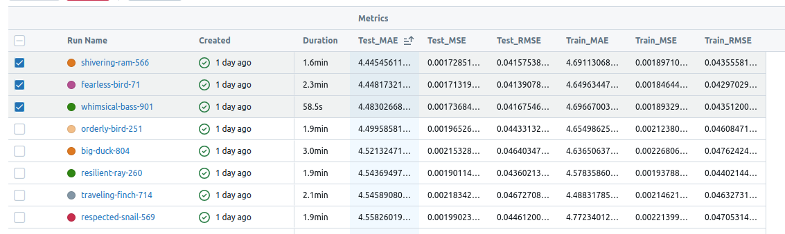
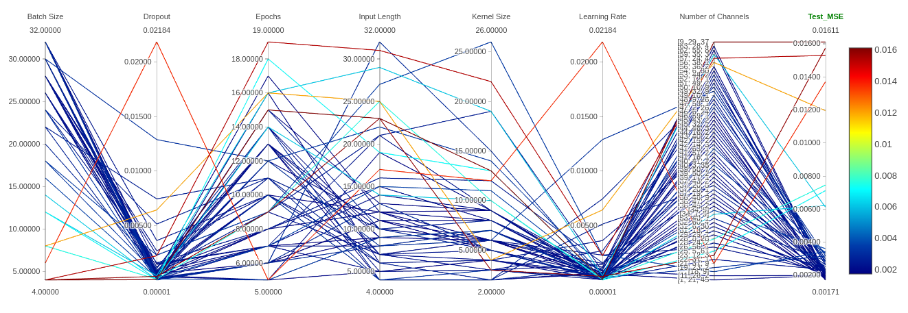
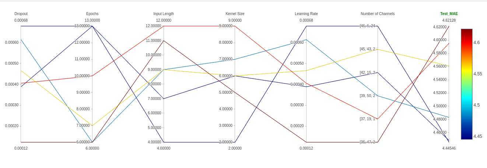
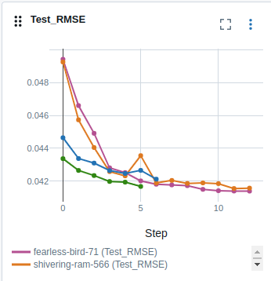

# Trening TCN

## Ogląd rezultatów

W tabeli zaznaczyłem najlepsze propozycje, które następnie bardziej szczegółowo porównam. Wybrałem modele na zasadzie najlepszych wyników na zbiorze testowym.

## Spostrzeżenia na temat parametrów

- Można zauważyć że natepuję korelacja między kernel_size a input_len co jest jak najbardziej uzasadanione.
- Podobna korelacja wystepuje przy lr i number of Channels co rownież jest uzasadnione
- Odwrotnie proporcjonalna zależność między Num Channels a wynikami
- Odwrotnie proporcjonalna zależność między epokami a batch size
- Odwrotnie proporcjonalna zależność między epokami a input len

## Analiza najlepszych modeli

Modele te uzyskaly delikatnie lepsze rezultaty niż LSTM, za to czas ich uczenia jest zauważalnie mniejszy

Nalepszy okazał się model **fearless-bird-71** o nastepujących rezutatach:
- Dropout: 0.00038829033545963545
- Epochs: 13
- Input Length: 7
- Kernel Size: 6
- Learning Rate: 0.00038829033545963545
- Number of Channels: [42, 15, 21, 40, 19, 9]
- Locations: all

jest to najlepszy dotychczasowy model.

## W celu jeszcze lepszego wyniku rzeczywistego osobno wytrenowaliśmy modelele dla każdej dlugości przewidywań 1-8. Jest to powtorzenie tych samych eksperymentow dla różnego input len.