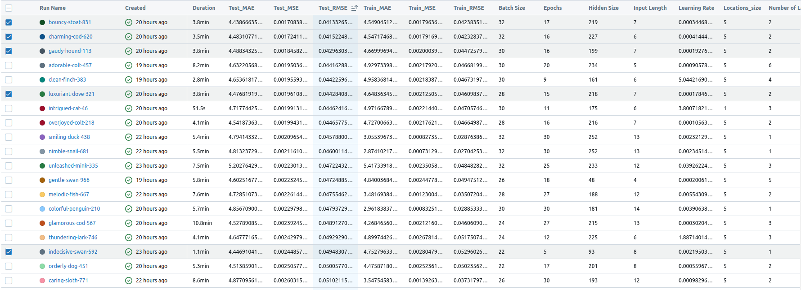
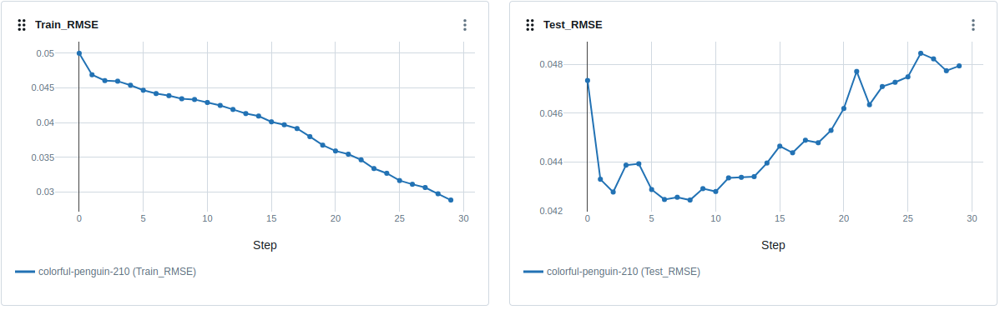
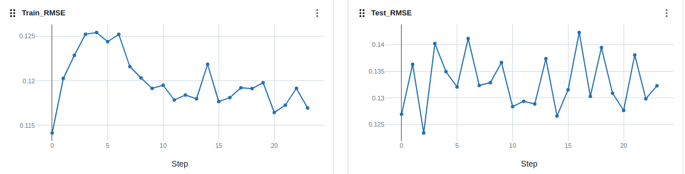
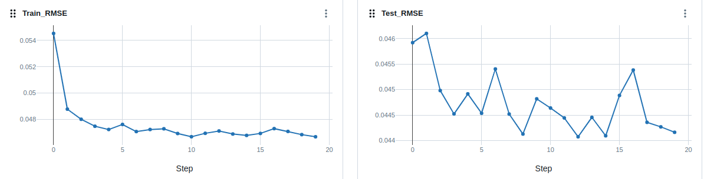
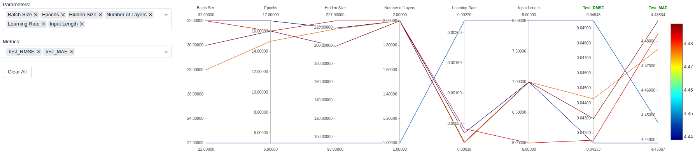
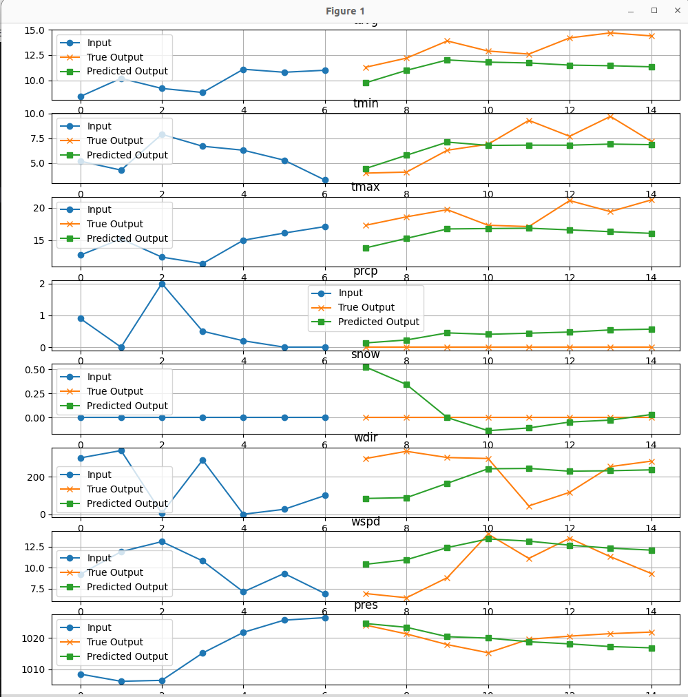
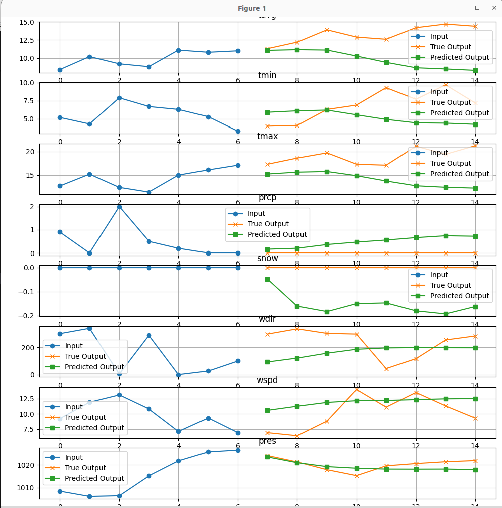
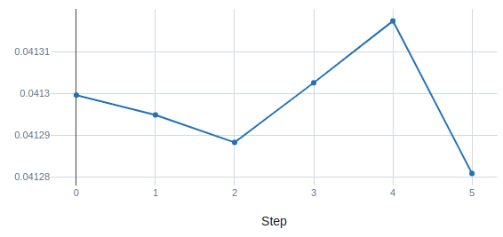
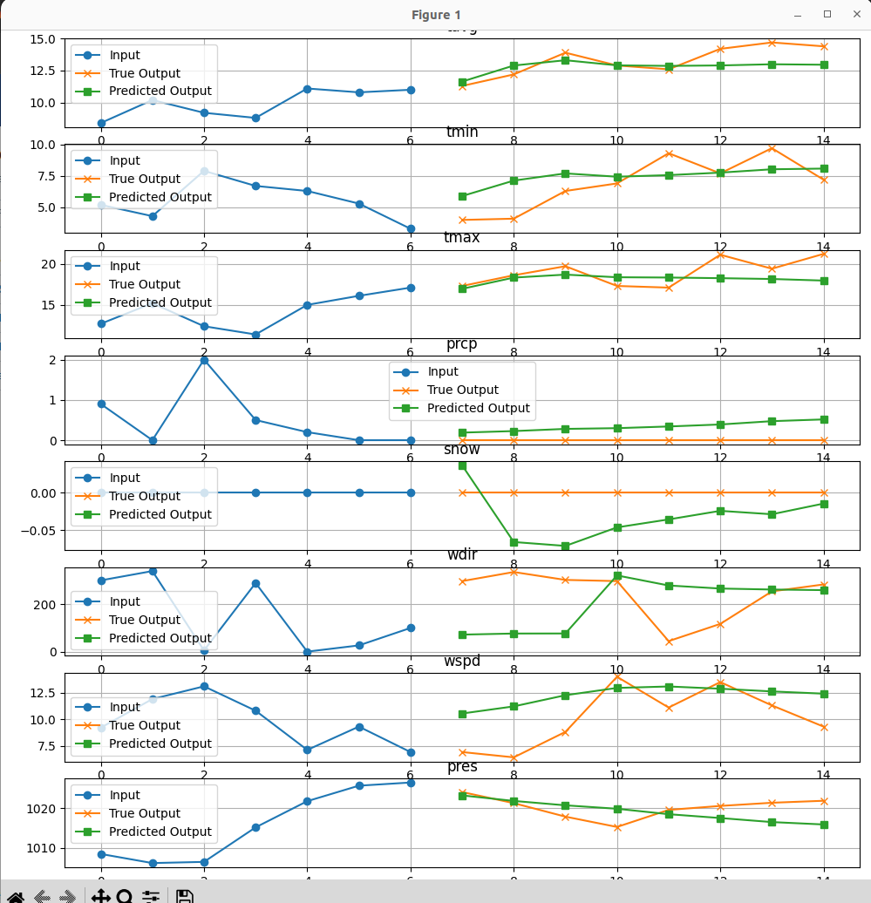

# Trening wstępny

## Ogląd rezultatów

W tabeli zaznaczyłem najlepsze propozycje, które następnie bardziej szczegółowo porównam. Wybrałem modele na zasadzie najlepszych wyników na zbiorze testowym.

## Spostrzeżenia na temat parametrów

- Dobre modele charakteryzują się wysokim batch_size, najlepsze mają nawet maksymalny, czyli 32.
- Liczba epoch umiarkowana. Przy większej liczbie epok możemy zauważyć wyraźny overfitting, np. tutaj:
  
- Hidden size - wysoki, ale nie osiągający max - dobrze dobrany zakres.
- Input len umiarkowany - przy mniejszym duża losowość modelu.
  
- Input len - stosunkowo niski, co jest zaskakujące.
- Learning rate (lr) - mały, w dotrenowaniu użyjemy dostosowującego się lr.
- Locations - ewidentnie lepszym pomysłem jest branie 5 lokalizacji zamiast jednej, co jest bardzo satysfakcjonujące, jako że to nasz autorski pomysł.
- Layers - mała liczba layer sprawdza się dobrze, przy większej mamy ewidentny overfitting.
  

## Analiza najlepszych modeli

Można powiedzieć, że Optuna zaproponowała 2 dobre strategie:
- Wysoki batch size, epochs, hidden size, number of layers, przy niskim lr i umiarkowanym input length.
- Większy input len i lr, ale mniejsze wartości dla innych parametrów.

Pierwsza strategia jest jednak nieco lepsza, szczególnie przy RMSE, druga ma swoje plusy przy MAE.
## Wizualizacja wynikow
Decydujemy się dotrenować dwa z wcześniej rozpatrywanych modeli.
### Pierwszy model: `bouncy-stoat-831`
- **Hidden Size**: 219
- **Number of Layers**: 2
- **Epochs**: 17
- **Locations_size**: 5
- **Learning Rate**: 0.00034468738253967245
- **Batch Size**: 32
- **Input Length**: 7

  

### Drugi model: `indecisive-swan-592`
- **Hidden Size**: 93
- **Number of Layers**: 1
- **Epochs**: 5
- **Model Type**: LSTM
- **Locations_size**: 5
- **Learning Rate**: 0.0021950336406807353
- **Batch Size**: 22
- **Input Length**: 8

# Dotrenowanie
Zdecydowaliśmy się dotrenować oba wybrane modele
## Wyniki
Dotrenowalismy oba modele korzystając z dynamicznego lr i uzyskaliśmy polepszenie modeli. Nadal wygrywa pierwsza strategia.
Dotrenowany model uznany zostaje za najlepszy LSTM dla przewidywań 8-dniowych

